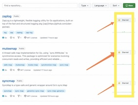
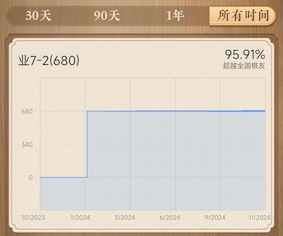

## Hi there 👋热烈欢迎贵宾光临 👋

这是我的介绍:

- 😄 杨亦乐
- 🔭 1990
- 🌱 男
- 👯 [西安电子科技大学(XDU)](https://www.xidian.edu.cn/) (2010-2014)
- 💼 职场经历 HuaWei ThoughtWorks BX PangQiu&PangDa&HuiOne
- 🤔 主要使用 Go 语言
- 💬 我是个兴趣使然的程序员
- 📫 偶尔有空时写写开源代码
- 😄 希望你给我点星星
- ⚡ Give me stars. Thank you!!! 谢谢大家。

## 英文文档

[English Documentation](README.md)

## 语言

## 贡献

## 说明

该文档由 [代码](yyle88.go)[逻辑](yyle88_test.go) 自动编写。 给我⭐ ⭐ ⭐谢谢！

## 给星
首先请点击这里的[项目仓库列表](https://github.com/yyle88?tab=repositories)

请按照下图的操作，把右边的点为 `Starred` 的状态

谢谢你，这对于我非常重要。

## 项目

这是我的项目：

| 项目名称 | 项目描述 |
|-------------------------------------------------|--------|
| [gobtcsign](https://github.com/yyle88/gobtcsign) | 简单的Go语言版本比特币创建钱包和签名逻辑 |
| [gotrontrx](https://github.com/yyle88/gotrontrx) | 简单的Go语言版本波场创建钱包/获得测试币/发出交易的逻辑 |
| [reggin](https://github.com/yyle88/reggin) | reggin means register gin routes. 非常简单的gin路由注册器。 |
| [gormcngen](https://github.com/yyle88/gormcngen) | gormcngen help gen enum code with gormcnm. 因为gormcnm能够以枚举定义字段名和字段类型，这个工具gormcngen就是自动帮你生成枚举代码的。 |
| [syncmap](https://github.com/yyle88/syncmap) | SyncMap is a type-safe and generic wrapper pkg around Go's sync.Map |

给我星星谢谢。

---

这是其它项目：

[其它项目](OTHERS.md)

---

## 其他

### 自拍

### 象棋

### 投资

## 感谢

给我⭐ ⭐ ⭐我们携手暴富，谢谢您！！！
